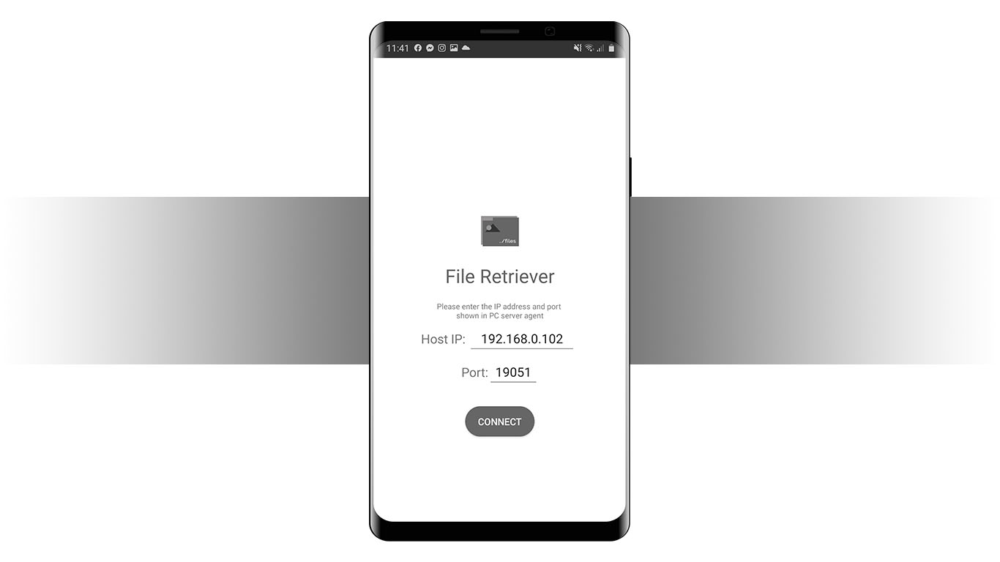
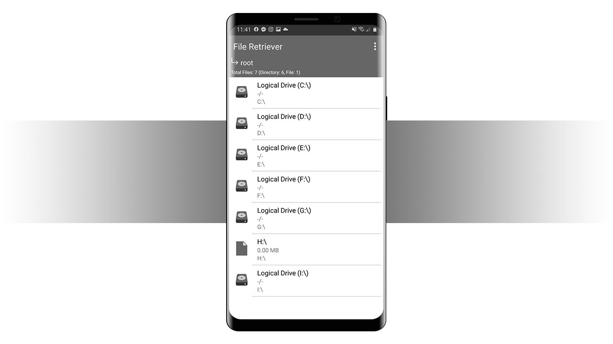
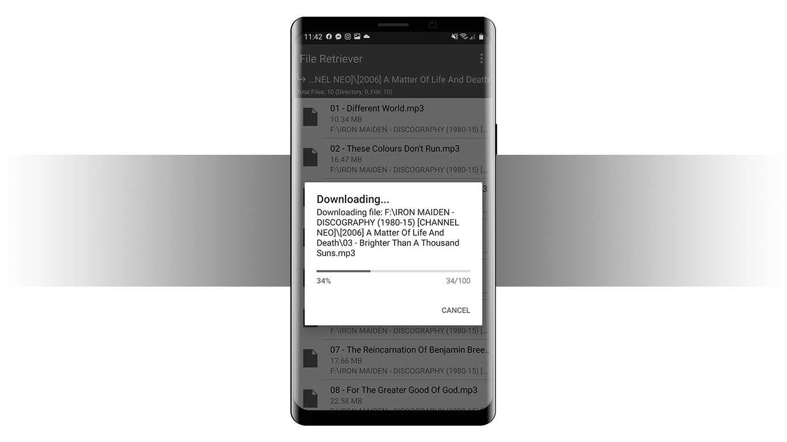
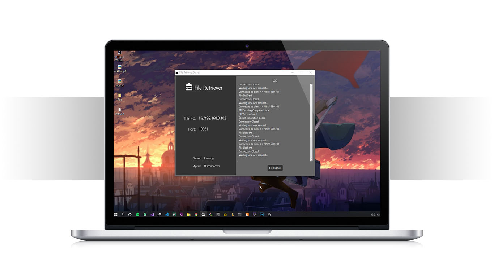


## File Retriever - A Simple Windows File Browser for Android 

**The tool can simply browse and download PC files in your android  device connected to the same network.** 

**Sample Screenshots:**

**Project Video:**
[https://youtu.be/gJ8J3rzevB8](https://youtu.be/gJ8J3rzevB8)

**Features:**
-   PC file browsing
-   Downloading files on mobile
-   FTP Support
-   Lightweight
-   Minimal UI

**Installation:**
You can build your own executables from this repo for the client Android app and server app from ([https://github.com/afifaniks/FileRetrieverServer](https://github.com/afifaniks/FileRetrieverServer).
Or you can simply download and install binaries from [here.](https://github.com/afifaniks/FileRetriever/releases)

**CAUTION:**
-   Both host and client devices have to be connected in the same network.
-   Both FTP and Socket connections will be used depending on download size.
-   Make sure client app connects to the server and port shown in server agent.
- The application is still in development stages. The moths (bugs) are definitely out there.

